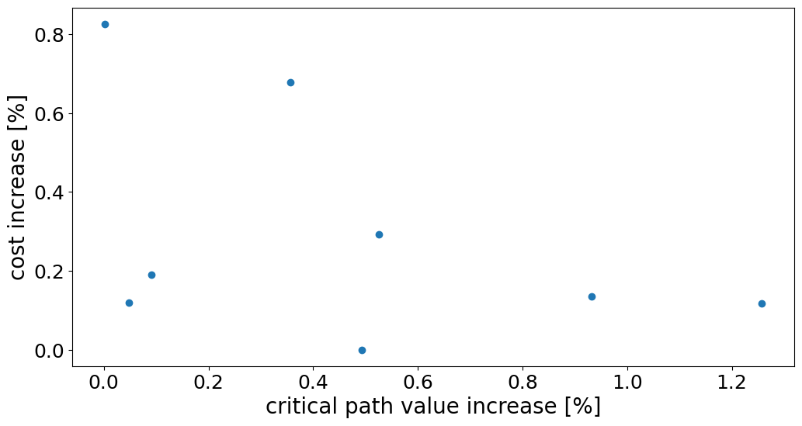

# Influence of the critical path value increase

This experiment is designed to examine what is the influence of critical path value (CPV) increase
on the scheduling cost. Mapping workflow to TTSP increases CPV and thus may require more
processing power what would be reflected in the cost.

### Methodology

Max subgraph size is set to the number of nodes in TTSP workflow (workflow is not be divided). Available workflow
instances were examined for the critical path value increase. Instances
with positive value were sorted according to CPV increase and 8 of them were selected to
cover full range of values. Next, selected instances were scheduled on the Gurobi solver and
the cost increase has been measured.

### Results

The highest noted cost increase was 0.8%, which is a very small value. CPV increases were not reflected in the cost
increases.