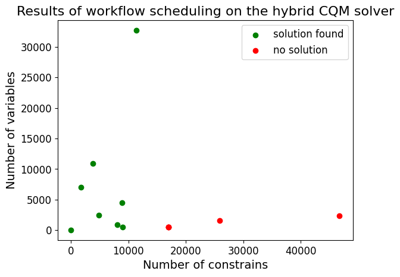

## CQM limits

CQM struggles with solving big workflow instances. To determine its capacity, we scheduled various workflow instances (
measurements were taken in 2024).
Each scheduling was compared with the Gurobi solver in terms of the scheduling cost. Collected results are available
in [this table](./cqm_limits.csv).

### Results

Scheduling results on CQM were very similar to Gurobi for the problems with number of constraints up to 11,500. Huge QM
performance degradation happened when
the number of constraints exceeded 17,000, because CQM did not return any correct problem
solution.