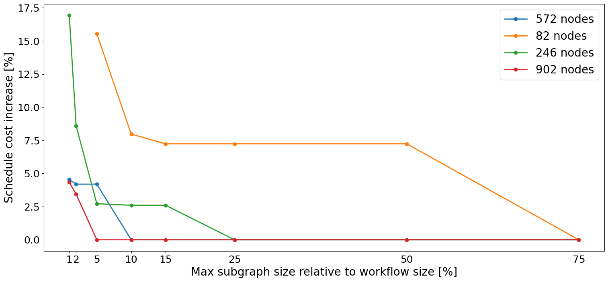
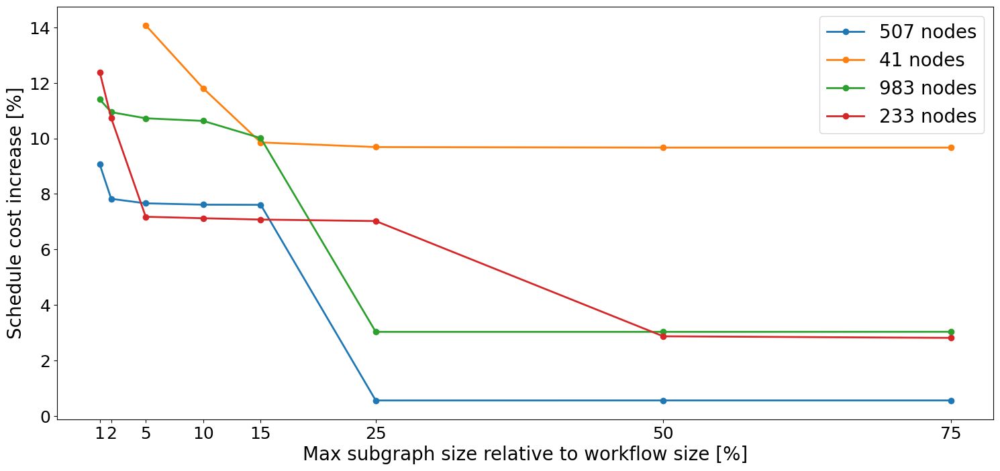
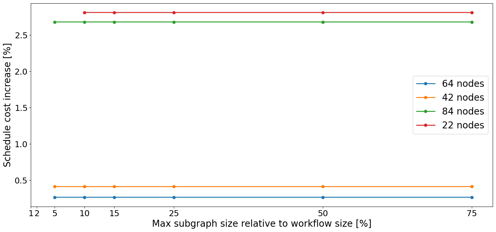

# Influence of the max subgraph size parameter

The goal of this experiment is to measure how max subgraph size parameter a)ects the
scheduling cost for selected workflow families.

### Methodology

Each family is represented by 4 workflow instances with various sizes. Each workflow is then divided using SPWD
algorithm with given max subgraph size.
Values of max subgraph size depend on the workflow size and are accordingly: 75%, 50%, 25%, 15%, 10%, 5%, 2%, 1% of its
task count. Divided workflows are scheduled on the Gurobi and the cost is measured, which is later compared with
scheduling cost on the raw gurobi (without SPWD).

### Results

Conducted experiments proved, that cost overhead caused by decomposition algorithm
di)er between workflow families and in most cases are acceptable. Increasing number of divisions causes bigger
differences in scheduling cost. The highest recorded increase was around
17.5% and occurred when scheduled graph size decreased 100 times, what is a satisfying result.

#### 1000Genome

#### Epigenomics

#### SRA Search

