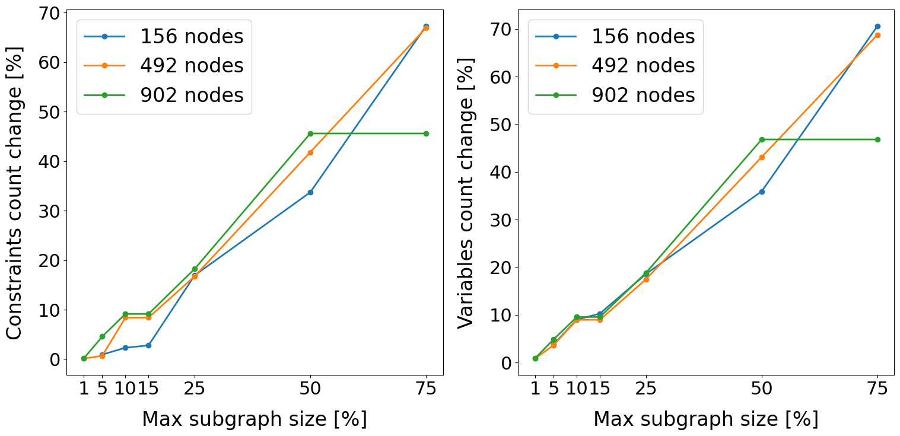
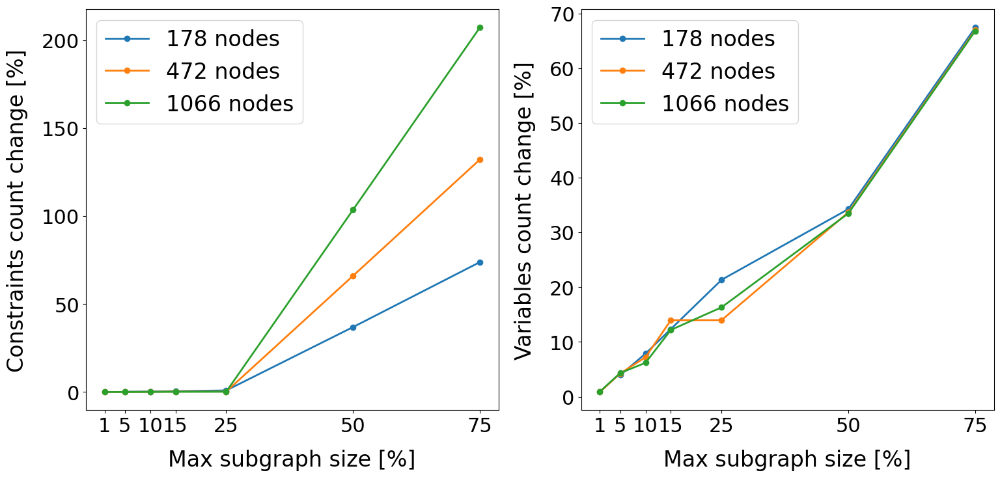
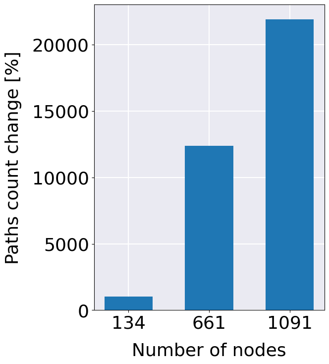

# Correlation between max subgraph size and problem size

Constrained Quadratic Model consists of constraints, variables and objective function, which contribute to the problem
size.
Relationship between workflow size (number of vertices) and those components is not obvious:

* Number of constraints in workflow transformation to CQM, depend on the path count
  and task count;
* Number of variables depend on the number of tasks and number of machines;
* Objective function is directly connected with variables, so it depends on the same
  factors.

As SPWD is controlled only by the max subgraph size parameter, final problem size for divided subgraphs cannot be
directly determined and depends on the workflow characteristics. The purpose of this experiment is to determine how SPWD
affects the problem size for known workflow families.

## Methodology

For each workflow family, 3 representative instances are selected and analyzed for the:

* number of constraints;
* number of variables.

Then, decomposition algorithm is applied with various values of max subgraph size parameter, that
are relative to the number of tasks in the workflow. Its value is expressed as a percentage
and considered values are: 75, 50, 25, 15, 10, 5, 1.
Experiment measures how certain value of max subgraph size influence the number
of constraints and variables in divided subgraphs.

## Results

Results have been collected in subfolders for each workflow family. They can be grouped into two categories:

### Every MSS decreases problem size

This group is represented by majority of families: 1000Genome, Epigenomics, Seismology, SoyKB, SRA Search. Every sampled
max subgraph size lead to actual decrease in the problem size, in terms of both number of variables and constraints.
Example for 1000Genome is shown below.

### Problem size increases at first

This behaviour has been observed for Montage and Cycles workflows. Due to mapping to TTSP (which is the first step of
SPWD), the number of constraints significantly increases. Number of variables decreases similarly as for other families.
Workflows from this group need mss to be small enough, to alleviate increased number of constraints. For example Montage
instance with 1066 nodes needed mss at level of 50% if its nodes to effectively decrease number of constraints.

### What causes an increase in the number of constraints

Negative effect of increased number of constraints is caused by the fact, that mapping to TTSP may add a significant
number of new paths to workflow. Each path contributes to one constraint in the assumed model, which leads to such
increase. Figure below shows how did the number of paths increase for few Cycles workflows, after mapping them to TTSP.
For the biggest workflow it increased more than 20000 times!

